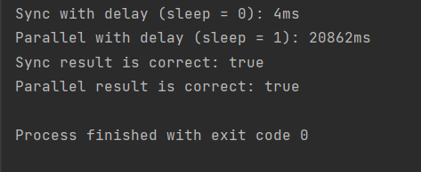

В цій програмі ми спочатку генеруємо два масиви input1 та input2 з випадковими числами від 0 до 100. Потім ми виконуємо перемноження елементів цих масивів за допомогою трьох різних методів:

multiplyArraysSync: Використовуємо традиційний цикл для перемноження елементів синхронно.
multiplyArraysParallel: Використовуємо паралельний потік для паралельного перемноження елементів.
multiplyArraysWithDelay: Використовуємо цикл з затримкою на кожній ітерації для синхронного перемноження елементів.
У методах multiplyArraysSync і multiplyArraysParallel ми повертаємо результат у вигляді нового масиву, а в методі multiplyArraysWithDelay ми просто виконуємо затримку і повертаємо результат.

Після виконання обох методів перемноження масивів з затримкою, ми також вимірюємо час виконання для кожного з них.